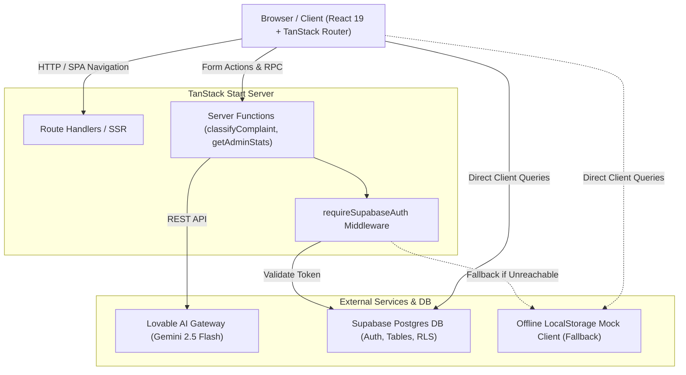
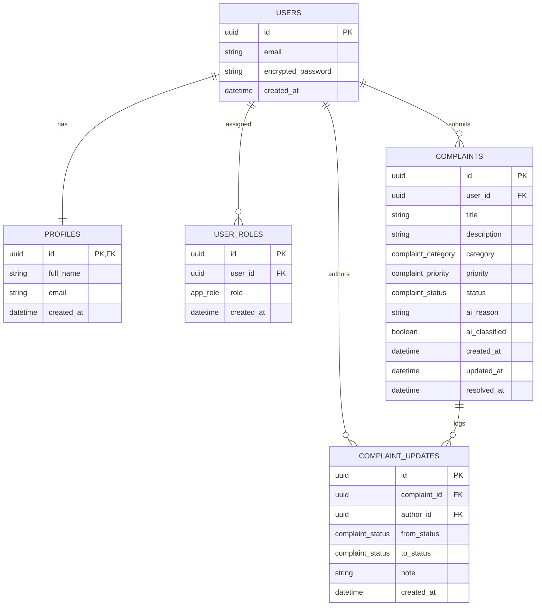
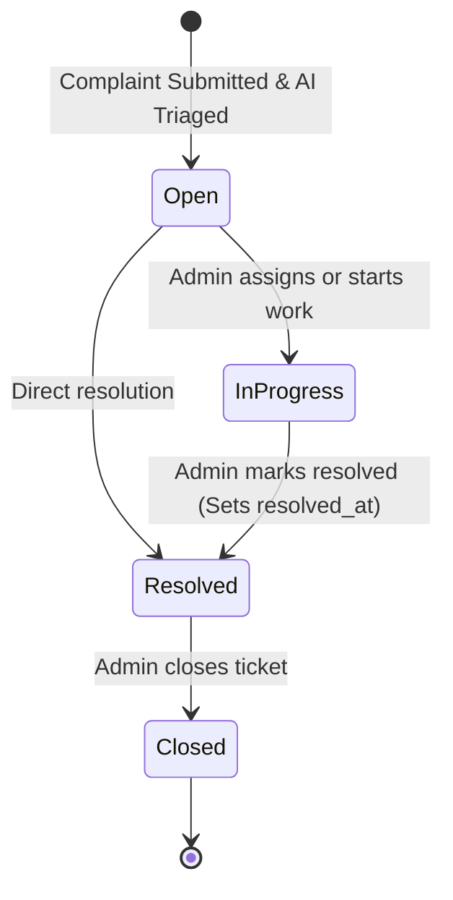
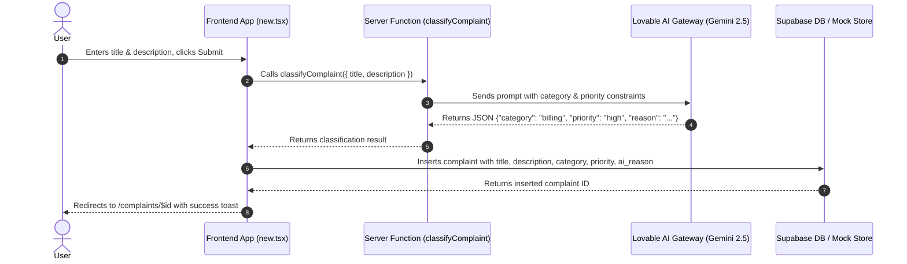

# Resolvely — AI Complaint Management System
> Comprehensive Project Documentation, Architecture, Schemas, Credentials & UML Diagrams

---

## 📋 Table of Contents
1. [Project Overview & Core Concept](#1-project-overview--core-concept)
2. [Technology Stack](#2-technology-stack)
3. [Test Credentials & Access Matrix](#3-test-credentials--access-matrix)
4. [Database Schemas & Tables](#4-database-schemas--tables)
5. [UML Diagrams](#5-uml-diagrams)
   - [System Architecture Diagram](#51-system-architecture-diagram)
   - [Entity-Relationship Diagram (ERD)](#52-entity-relationship-diagram-erd)
   - [Complaint Lifecycle State Diagram](#53-complaint-lifecycle-state-diagram)
   - [AI Triage & Submission Sequence Diagram](#54-ai-triage--submission-sequence-diagram)
6. [How to Run & Environment Setup](#6-how-to-run--environment-setup)

---

## 1. Project Overview & Core Concept

**Resolvely** is a full-stack, AI-driven customer support complaint intake and triage platform. It streamlines customer ticket management by using generative AI (Google Gemini 2.5 Flash) to automatically categorize complaints and assign urgency priorities upon submission.

### Key Capabilities
- **Automated AI Triage:** Classifies complaints into categories (`billing`, `technical`, `service`, `product`, `delivery`, `account`, `other`) and urgency levels (`low`, `medium`, `high`, `urgent`) with zero manual effort.
- **Dual User Experience:**
  - **Customer Portal:** Submit complaints, receive instant AI triage explanations, and track live status updates.
  - **Admin Analytics Dashboard:** System-wide metrics, resolution trends, category breakdown charts, priority mix pie charts, and ticket status management.
- **Role-Based Access Control (RBAC):** First registered user automatically becomes the system `admin`. Subsequent users receive standard `user` permissions.
- **Offline / Standalone Resilience:** Includes an in-memory & `localStorage` fallback mock engine so the entire app runs offline or without an external database instance.

---

## 2. Technology Stack

| Layer | Technologies / Libraries |
| :--- | :--- |
| **Framework** | [TanStack Start](https://tanstack.com/start) (Full-stack React Framework) with SSR support |
| **Routing** | [TanStack Router](https://tanstack.com/router) (File-based, type-safe routing) |
| **State & Data Fetching** | [TanStack Query](https://tanstack.com/query) (`@tanstack/react-query`) |
| **UI Components & Icons** | Tailwind CSS v4, Radix UI Primitives, Lucide React Icons (`lucide-react`) |
| **Data Visualization** | Recharts (`recharts`) |
| **Database & Auth** | Supabase JS (`@supabase/supabase-js`) + Fallback Local Storage Mock Client |
| **AI Integration** | Lovable AI Gateway (`google/gemini-2.5-flash`) via TanStack Server Functions |

---

## 3. Test Credentials & Access Matrix

### Pre-Seeded Test Accounts

| Account Type | Email | Password | Full Name | Default Assigned Role |
| :--- | :--- | :--- | :--- | :--- |
| **Admin User** | `admin@example.com` | `Password123!` | Admin User | `admin` |
| **Standard User** | `user2@example.com` | `Password123!` | Test User 2 | `user` |

> 💡 **Note:** You can also register a new account via the **Sign up** tab on `/auth`. The first user registered in a fresh database receives `admin` role automatically.

### Access Control Matrix

| Feature / Route | Route Path | Admin Role | User Role | Unauthenticated |
| :--- | :--- | :---: | :---: | :---: |
| Auth Page | `/auth` | ✅ | ✅ | ✅ |
| Customer Dashboard | `/_authenticated/dashboard` | ✅ | ✅ | ❌ (Redirects to `/auth`) |
| Submit New Ticket | `/_authenticated/new` | ✅ | ✅ | ❌ (Redirects to `/auth`) |
| Ticket Details | `/_authenticated/complaints/$id` | ✅ | ✅ (Own tickets only) | ❌ (Redirects to `/auth`) |
| Change Ticket Status | `/_authenticated/complaints/$id` | ✅ | ❌ | ❌ |
| Admin Analytics | `/_authenticated/admin` | ✅ | ❌ (Redirects to `/dashboard`) | ❌ |

---

## 4. Database Schemas & Tables

### Enums

```sql
CREATE TYPE public.app_role AS ENUM ('admin', 'user');
CREATE TYPE public.complaint_category AS ENUM ('billing','technical','service','product','delivery','account','other');
CREATE TYPE public.complaint_priority AS ENUM ('low','medium','high','urgent');
CREATE TYPE public.complaint_status AS ENUM ('open','in_progress','resolved','closed');
```

### Table Definitions

#### 1. `profiles`
Stores user profile information. Linked to `auth.users`.
```sql
CREATE TABLE public.profiles (
  id UUID PRIMARY KEY REFERENCES auth.users(id) ON DELETE CASCADE,
  full_name TEXT,
  email TEXT,
  created_at TIMESTAMPTZ NOT NULL DEFAULT now()
);
```

#### 2. `user_roles`
Stores user role assignments for RBAC (`admin` vs `user`).
```sql
CREATE TABLE public.user_roles (
  id UUID PRIMARY KEY DEFAULT gen_random_uuid(),
  user_id UUID NOT NULL REFERENCES auth.users(id) ON DELETE CASCADE,
  role public.app_role NOT NULL,
  created_at TIMESTAMPTZ NOT NULL DEFAULT now(),
  UNIQUE(user_id, role)
);
```

#### 3. `complaints`
Main complaint tickets table containing AI classification metadata and resolution timestamps.
```sql
CREATE TABLE public.complaints (
  id UUID PRIMARY KEY DEFAULT gen_random_uuid(),
  user_id UUID NOT NULL REFERENCES auth.users(id) ON DELETE CASCADE,
  title TEXT NOT NULL,
  description TEXT NOT NULL,
  category public.complaint_category NOT NULL DEFAULT 'other',
  priority public.complaint_priority NOT NULL DEFAULT 'medium',
  status public.complaint_status NOT NULL DEFAULT 'open',
  ai_reason TEXT,
  ai_classified BOOLEAN NOT NULL DEFAULT false,
  created_at TIMESTAMPTZ NOT NULL DEFAULT now(),
  updated_at TIMESTAMPTZ NOT NULL DEFAULT now(),
  resolved_at TIMESTAMPTZ
);
```

#### 4. `complaint_updates`
Audit trail table logging all status transitions and staff notes.
```sql
CREATE TABLE public.complaint_updates (
  id UUID PRIMARY KEY DEFAULT gen_random_uuid(),
  complaint_id UUID NOT NULL REFERENCES public.complaints(id) ON DELETE CASCADE,
  author_id UUID REFERENCES auth.users(id) ON DELETE SET NULL,
  note TEXT,
  from_status public.complaint_status,
  to_status public.complaint_status,
  created_at TIMESTAMPTZ NOT NULL DEFAULT now()
);
```

### Database Functions & Triggers

1. **`has_role(_user_id, _role)`**: Helper function to verify user role in RLS policies and application queries.
2. **`handle_new_user()`**: Trigger function executed on `auth.users` insert. Automatically populates `profiles` and assigns `admin` to the first user or `user` to subsequent sign-ups.
3. **`complaints_set_updated_at`**: Automatically updates `updated_at` and sets `resolved_at = now()` when a complaint status changes to `resolved`.
4. **`complaints_log_status`**: Automatically appends an entry to `complaint_updates` whenever ticket status changes.

---

## 5. UML Diagrams

### 5.1 System Architecture Diagram



---

### 5.2 Entity-Relationship Diagram (ERD)



---

### 5.3 Complaint Lifecycle State Diagram



---

### 5.4 AI Triage & Submission Sequence Diagram



---

## 6. How to Run & Environment Setup

### Environment File (`.env`)
```env
VITE_SUPABASE_PROJECT_ID="tbhfgmxfeqtdnnyywfkt"
VITE_SUPABASE_PUBLISHABLE_KEY="sb_publishable_vs5XKVKkoPFlVh2ksm30DQ_3EMxysbW"
VITE_SUPABASE_URL="https://tbhfgmxfeqtdnnyywfkt.supabase.co"
```

### Development Server Command
Run the dev server using Node 22 via `npx` (pre-configured in `package.json`):

```bash
npm run dev
```

The application will start at: **http://localhost:8080/**
